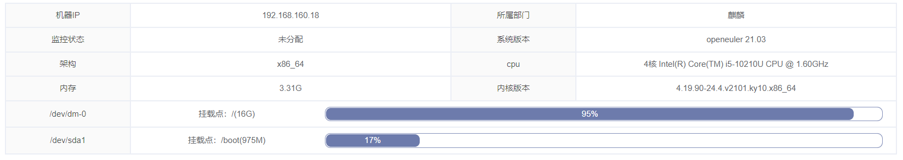
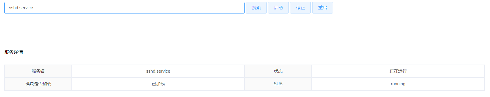
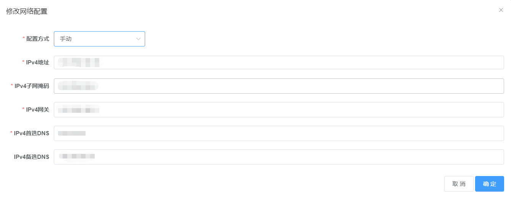
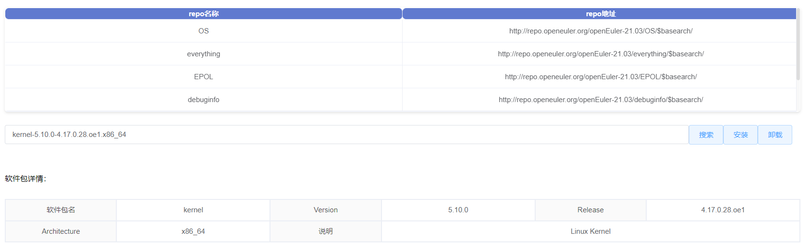
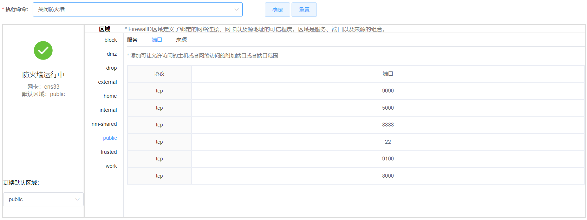
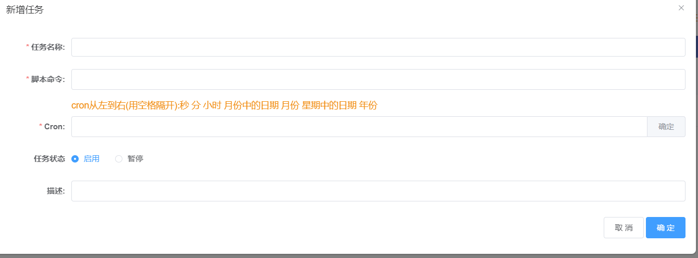
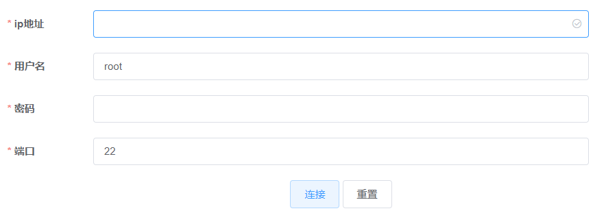

# agent端功能

## 核心功能

### 系统基本信息获取
- 系统版本、架构
- cpu核数、型号
- 内核版本
- 磁盘利用率

### 系统配置
- 系统服务用户列表获取
- 系统服务信息列表、管理（启动、重启、停止）

- 网络配置（IPV4连接详情及修改）

- 内核参数获取及修改
- repo源获取及软件包列表、安装、卸载

- 基本防火墙配置、重启、关闭等

- 轻量级定时任务  

- 终端

