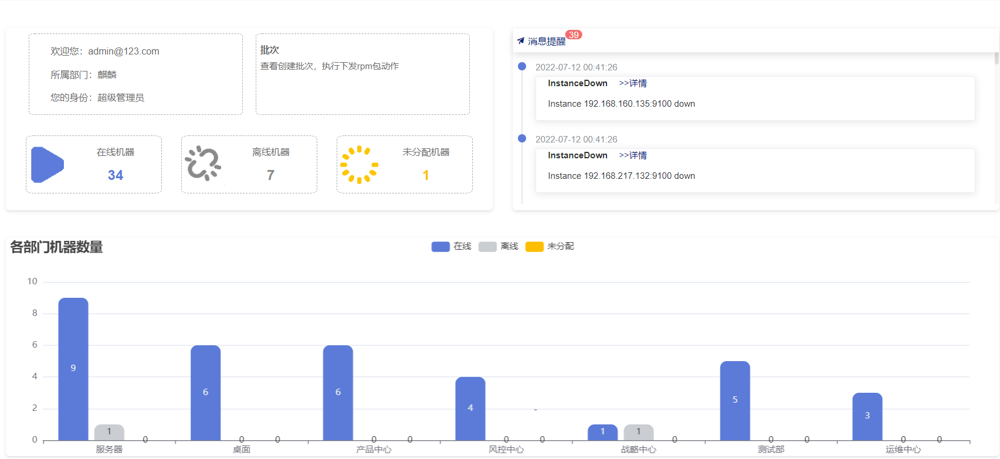
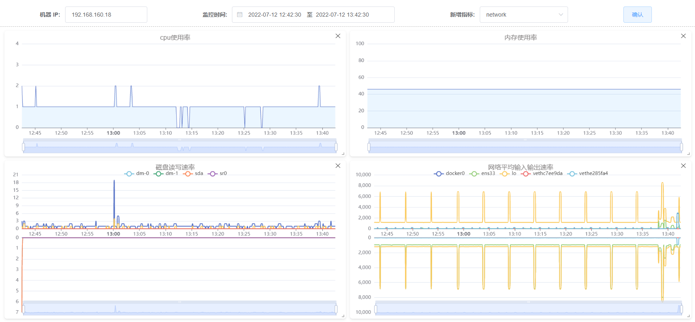
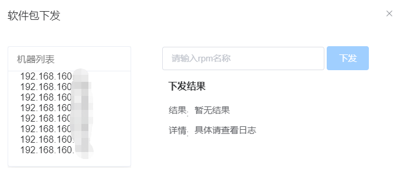
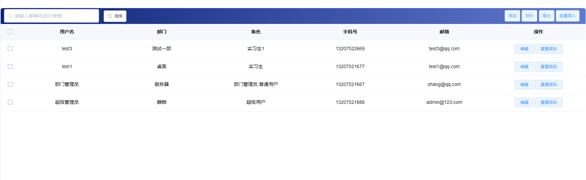
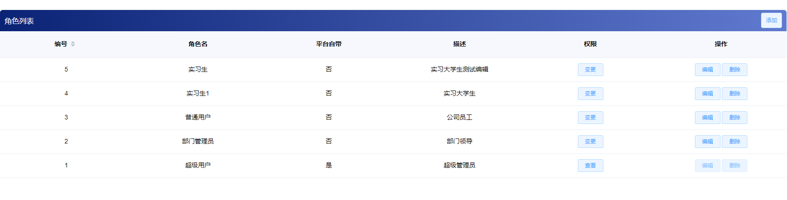
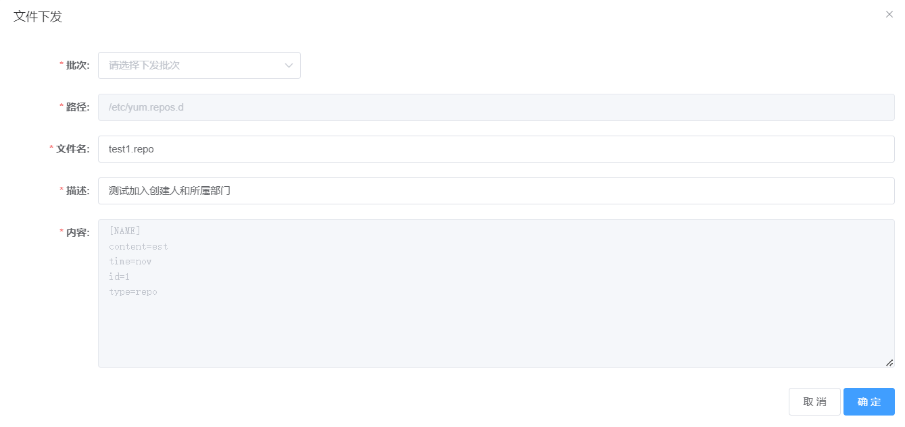

# 服务端功能

## 核心功能

### 集群概览
主要分为三个区域：
1. 显示受管控机器的状态和数量以及登录用户的基本信息
2. 对各部门下的所属机器数量统计
3. 受监控的机器连接故障提供告警消息和邮件发送服务

### 系统
- 机器列表  
该页面主要有以下几个功能：  
1. 提供对组织部门树的管理，超级管理员可以对部门名称和所属结构等进行增、删、改管理；  
2. 点选相应部门可以查询到该部门及子部门下的所有机器列表，并且可以对某台机器做变更部门的处理；  
3. 提供机器详情页点击链接和`监控`查询通道。

- 创建批次  
查验登录权限，拥有该功能的登录用户可以创建批次，以便于实施机器的批量管控。  
创建批次遵循两种创建规则：  
1. 根据部门选择机器：点选部门复选框，从而选中该部门下所有管控的机器；  
2. 根据特定IP选择机器：点选部门下的某些机器IP，创建批次。

- 性能监控  
PilotGo提供agent机器的实时性能监控功能，依托Prometheus，可以实时监控机器CPU、内存、磁盘读写速率以及网络平均输入I/O等指标。  

### 批次
- 获取批次列表
- 获取批次详情
- 选中管控批次执行批次rpm下发和卸载的操作

### 用户管理
管理使用PilotGo系统平台的用户，有以下功能：  
- 修改用户信息
- 重置密码
- 删除用户
- 批量导入用户
- 导出用户列表

### 权限管理
初次部署PilotGo平台，自动注册超级管理员，超管具有所有的平台权限：  
1. 创建新的用户角色，并赋予其权限；
2. 灵活变更用户角色的权限；
3. 不同的登录用户，其角色不同，平台的功能权限不同，对机器的操作权限不同。

### 配置管理
- 配置文件下发  
保存在数据库中的配置文件下发到指定批次机器

### 日志管理
该功能页面是用户操作agent机器的溯源：  
- 父页面展示用户名称、所属部门、操作类型、操作完成度等；
- 子页面展示操作对象（文件名字/服务名称/RPM包名称等）、类型（安装/卸载/重启/关闭等）、整体状态（成功/失败）、进度比、每个agent机器的具体完成状态和结果原因。

## 其他功能

### 推送告警
- agent机器断开连接，页面推送告警提示；
- agent端repo源变动，页面推送告警提示；
- agent端网络连接状态变动，页面推送告警提示。

### agent管理
- [agent管理](./agent.md)