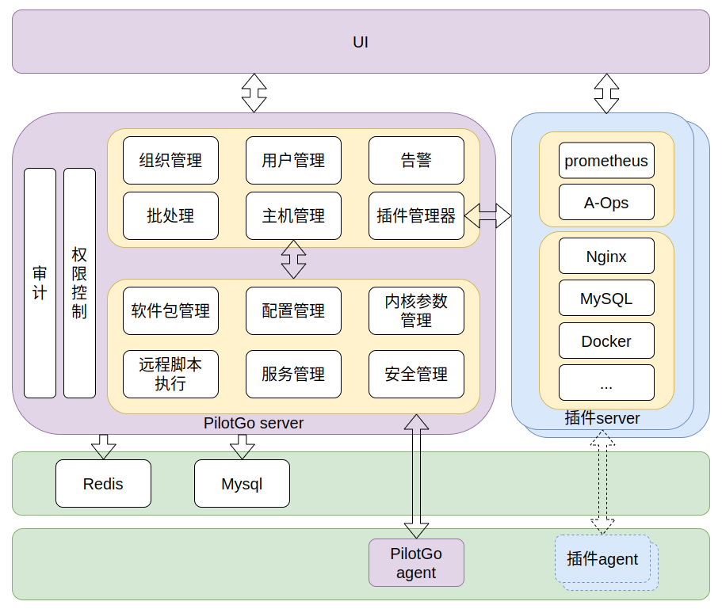
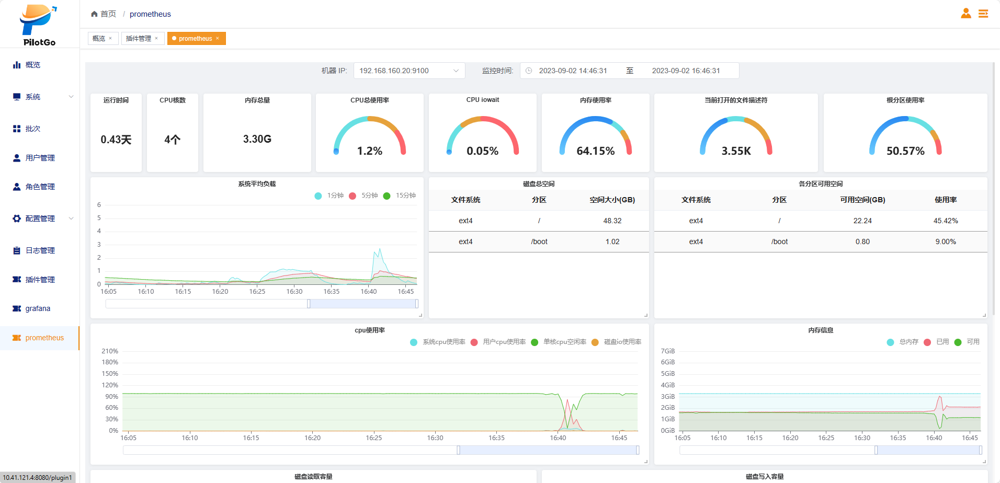
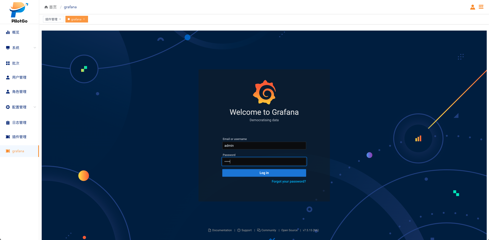

# PilotGo介绍

PilotGo 是 openEuler 社区原生孵化的运维管理平台，采用插件式架构设计，功能模块轻量化组合、独立迭代演进，同时保证核心功能稳定；同时使用插件来增强平台功能、并打通不同运维组件之间的壁垒，实现了全局的状态感知及自动化流程。

## 功能描述

PilotGo 核心功能模块包括：

* 用户管理：支持按照组织结构分组管理，支持导入已有平台账号，迁移方便；

* 权限管理：支持基于RBAC的权限管理，灵活可靠；
  
* 主机管理：状态前端可视化、直接执行软件包管理、服务管理、内核参数调优、简单易操作；
  
* 批次管理：支持运维操作并发执行，稳定高效；
 
* 日志审计：跟踪记录用户及插件的变更操作，方便问题回溯及安全审计；

* 告警管理：平台异常实时感知；

* 插件功能：支持扩展平台功能，插件联动，自动化能力倍增，减少人工干预。

当前OS发布版本还集成了以下插件：

* Prometheus：托管Prometheus监控组件，自动化下发及配置node-exporter监控数据采集，对接平台告警功能；

* Grafana：集成Grafana可视化平台，提供美观易用的指标监控面板功能。

## 应用场景

PiotGo可用于典型的服务器集群管理场景，支持大批量的服务器集群基本管理及监控；通过集成对应的业务功能插件，还可实现业务集群的统一平台管理，例如Mysql数据库集群、redis数据缓存集群、nginx网关集群等。
