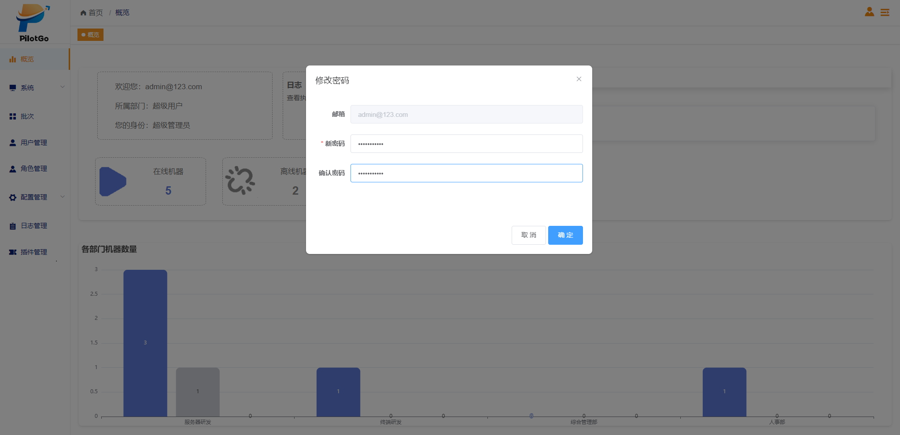
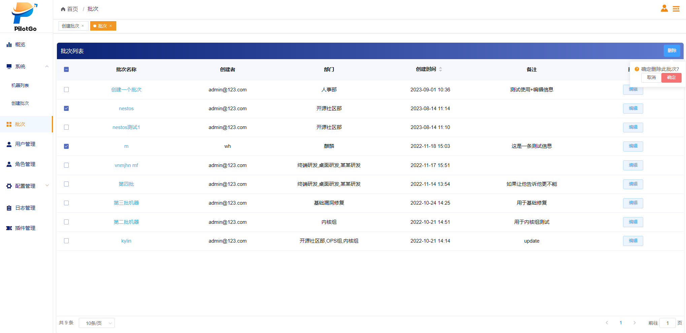
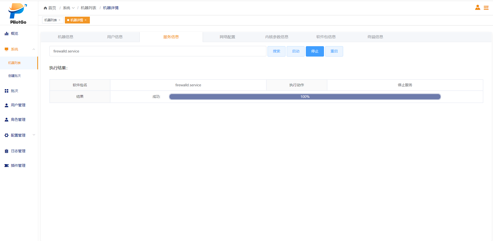
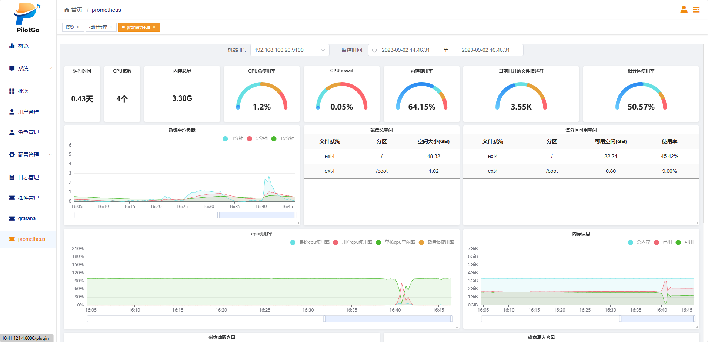
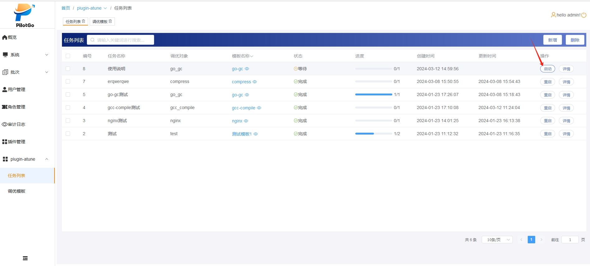

# PilotGo平台使用手册

PilotGo 是一个 openEuler 社区原生的运维管理平台，采用插件式开发，增强平台的扩展性、并打通不同运维组件之间的壁垒。PilotGo 核心功能包括：集群管理、批次管理、主机管理、用户管理、权限管理、主机监控、运维审计等。

## 1 PilotGo安装与配置

PilotGo可以单机部署也可以采用集群式部署。安装之前先关闭防火墙。

### 1.1 PilotGo-server 安装与配置

安装mysql

```shell
dnf install mysql-server
vim /etc/my.cnf
#在mysqld配置节下新增bind-address，值为本机ip
[mysqld]
bind-address=192.168.1.1
#重启mysql服务
systemctl restart mysqld
#设置mysql数据库的root用户访问权限
[root@localhost ~] mysql

mysql> show databases;
mysql> use mysql;
mysql> select user,host from user; -- 此处出现host为localhost时，说明mysql只允许本机连接，外网和本地软件客户端则无法连接。

+---------------+-----------+
| user          | host      |
+---------------+-----------+
| root          | localhost |
| mysql.session | localhost |
| mysql.sys     | localhost |
+---------------+-----------+
3 rows in set (0.00 sec)
mysql> update user set host = '%' where user='root'; -- 设置允许root用户任意IP访问。
mysql> flush privileges; -- 刷新权限
mysql> exit
```

安装redis，设置redis密码（修改）,运行命令：

```shell
dnf install redis6
vim /etc/redis/redis.conf
#requirepass foobared去掉注释，foobared改为自己的密码
bind 0.0.0.0
```

启动MySQL和redis服务，然后执行：

```shell
dnf install PilotGo-server
```

修改/opt/PilotGo/server/config_server.yaml里面mysql和redis的配置信息，启动服务：

```shell
systemctl start PilotGo-server
```

访问页面：<http://ip:8888>

### 1.2 PilotGo-agent安装与配置

执行以下命令进行安装：

`dnf install PilotGo-agent`

修改/opt/PilotGo/agent/config_agent.yaml里面的ip信息，启动服务：

`systemctl start PilotGo-agent`

### 1.3 PilotGo插件安装与配置

详情见3 插件使用手册

## 2 PilotGo平台使用说明

### 2.1 首次登录

#### 2.1.1 用户登录页面

用户登录页面如图所示，输入正确的用户名和密码登录系统。默认用户名为admin，默认密码为admin，首次登录之后建议先修改密码。


### 2.2 用户模块

#### 2.2.1 创建用户

创建用户的方式又两种，一种是手动创建单个用户，另外一种是批量导入多个用户。

##### 2.2.1.1 创建单个用户

1. 具有创建用户权限的用户成功登录之后点击左侧导航栏中的用户管理；
2. 点击页面右上角的添加按钮；
3. 在页面中输入用户名、密码、邮箱，选择部门和角色类型，并点击确定按钮；
4. 页面弹框提示“添加用户成功”，并显示新创建的用户信息，表示创建用户成功。 

##### 2.2.1.2 批量导入多个用户

1. 具有创建用户权限的用户成功登录之后点击左侧导航栏中的用户管理；
2. 点击页面的批量导入按钮，选择文件点击打开按钮；
3. 显示用户信息则完成用户导入。

#### 2.2.2 修改用户信息及密码

##### 2.2.2.1 修改用户信息

1. 具有该权限的用户成功登录，点击左侧导航栏中的用户管理；
2. 找到用户信息，点击操作栏中的编辑按钮；
3. 在页面中输入要修改的用户信息，并点击确定按钮；
4. 页面弹框提示“用户信息修改成功”，并显示修改后的用户信息。

##### 2.2.2.2 修改密码

修改密码有两种方式，第一是用户知道密码登录系统后自己修改，第二是用户忘记密码，由管理员登录系统后重置此用户密码，重置默认密码为邮箱@符号的前半部分。

###### 2.2.2.2.1 手动修改密码

1. 用户登录系统后点击右上角的人像图标和修改密码；
2. 连续输入两次新密码，点击确定按钮；
3. 页面弹框提示“修改成功”。

###### 2.2.2.2.2 重置密码

1. 管理员登录成功后点击左侧导航栏中的用户管理；
2. 找到用户信息，点击操作栏中的重置密码按钮；
3. 用户使用默认密码可以登录系统。

#### 2.2.3 删除用户

1. 管理员登录成功后点击左侧导航栏中的用户管理；
2. 点击页面小方块选择要删除的用户；
3. 点击页面右上角的删除按钮，并点击确定；
4. 页面弹框提示“用户删除成功”，并用户管理页面不显示删除用户的信息。

#### 2.2.4 导出用户

1. 具有该权限的用户成功登录，点击左侧导航栏中的用户管理；
2. 点击页面的导出按钮；
3. 浏览器显示下载进度，成功下载后打开xlsx文件查看信息。

### 2.3 角色模块

#### 2.3.1 添加角色

1. 具有该权限的用户成功登录，点击左侧导航栏中的角色管理；
2. 点击页面的添加按钮；
3. 输入角色名和描述信息，并点击确定按钮；
4. 页面弹框提示“新增角色成功”，并页面显示新添加的角色信息。

### 2.3.2 修改角色

#### 2.3.2.1 修改角色信息

1. 具有该权限的用户成功登录，点击左侧导航栏中的角色管理；
2. 点击对应角色的编辑按钮；
3. 输入新的角色名和描述信息，并点击确定按钮；
4. 页面弹框提示“角色信息修改成功”，并页面显示修改后的角色信息。

#### 2.3.2.2 修改角色权限

1. 具有该权限的用户成功登录，点击左侧导航栏中的角色管理；
2. 点击对应角色的变更按钮；
3. 选择相应的权限，点击重置按钮可以清空所选权限，并点击确定按钮；
4. 页面弹框提示“角色权限变更成功”。

### 2.3.3 删除角色

1. 具有该权限的用户成功登录，点击左侧导航栏中的角色管理；
2. 点击对应角色的删除按钮，并点击确定；
3. 页面弹框提示“角色删除成功”，并不显示删除的角色信息。

### 2.4 部门树模块

#### 2.4.1 修改部门节点

1. 具有该权限的用户成功登录，点击左侧导航栏中的系统和机器列表；
2. 在部门节点对应位置点击修改符号，输入节点名字并点击确定；
3. 页面弹框提示“修改成功”，并显示修改后的部门节点信息。

#### 2.4.2 删除部门节点

1. 具有该权限的用户成功登录，点击左侧导航栏中的系统和机器列表；
2. 在部门节点对应位置点击删除符号并点击确定；
3. 页面弹框提示“删除成功”，并不显示删除节点的信息。

### 2.5 配置库模块

#### 2.5.1 添加 repo 配置文件

1. 具有该权限的用户成功登录，点击左侧导航栏中的库配置文件；
2. 点击页面的新增按钮；
3. 输入文件名、文件类型、文件路径、描述和内容等信息，文件名必须以.repo结尾，文件路径必须正确，文件内容要符合repo文件的格式，并点击确定按钮；
4. 页面弹框提示“文件保存成功”；并显示新增的repo配置文件信息。

#### 2.5.2 修改 repo 配置文件

1. 具有该权限的用户成功登录，点击左侧导航栏中的库配置文件；
2. 找到要修改的repo文件，点击对应的编辑按钮；
3. 输入修改后的文件名、文件类型、文件路径、描述和内容等信息，并点击确定按钮；
4. 页面弹框提示“配置文件修改成功”；并显示修改后的repo配置文件信息。

#### 2.5.3 删除 repo 配置文件

1. 具有该权限的用户成功登录，点击左侧导航栏中的库配置文件；
2. 选择要删除的文件，点击页面的删除按钮，并点击确定；
3. 页面弹框提示“存储的文件已从数据库删除”，且页面不显示删除的repo配置文件信息。

#### 2.5.4 下发 repo 配置文件

1. 具有该权限的用户成功登录，点击左侧导航栏中的库配置文件；
2. 找到要下发的文件，点击页面的下发按钮，选择要下发的批次，并点击确定；
3. 页面弹框提示“配置文件下发成功”。

#### 2.5.5 回滚 repo 配置文件历史版本

1. 具有该权限的用户成功登录，点击左侧导航栏中的库配置文件；
2. 找到要回滚的文件，点击页面的历史版本按钮；
3. 选择要回滚的版本，点击回滚按钮并点击确定；
4. 页面弹框提示“已回退到历史版本”，历史版本页面增加一条“-latest”记录。

### 2.6 批次模块

#### 2.6.1 创建批次

1. 具有该权限的用户成功登录，点击左侧导航栏中的系统和创建批次；
2. 点击机器所在的部门名字，在备选项中选择0个或多个机器ip(点击ip前面的方框)，若选择一个或多个部门的所有机器可以点击部门列表的方框，并点击备选项中的部门名称，选择完成后点击向右的箭头；
3. 输入批次名称和描述，并点击创建按钮；
4. 页面弹框提示“批次入库成功”，并批次页面显示新创建的批次信息。

#### 2.6.2 修改批次

1. 具有该权限的用户成功登录，点击左侧导航栏中的批次；
2. 点击对应批次的编辑按钮；
3. 输入新的批次名称和备注信息，并点击确定按钮；
4. 页面弹框提示“批次修改成功”，并显示修改后的批次信息。

#### 2.6.3 删除批次

1. 具有该权限的用户成功登录，点击左侧导航栏中的批次；
2. 选择要删除的批次，点击删除按钮并点击确定；
3. 页面弹框提示“批次删除成功”，并不显示删除批次的信息。

#### 2.6.4 批量安装软件包

1. 具有该权限的用户成功登录，点击左侧导航栏中的批次，并点击批次名称；
2. 点击右上角的rpm下发按钮，在搜索框输入软件包的名称，并点击下发按钮；
3. 页面弹框提示“软件包安装成功”，agent端可以查到下发的rpm包。

#### 2.6.5 批量卸载软件包

1. 具有该权限的用户成功登录，点击左侧导航栏中的批次，并点击批次名称；
2. 点击右上角的rpm卸载按钮，在搜索框输入软件包的名称，并点击卸载按钮；
3. 页面弹框提示“软件包卸载成功”，agent端无此软件包。

### 2.7 机器模块

#### 2.7.1 删除机器

1. 具有该权限的用户成功登录，点击左侧导航栏中的系统和机器列表；
2. 选择要删除的机器，点击删除按钮并点击确定；
3. 页面弹框提示“机器删除成功”，并不显示删除机器的信息。

#### 2.7.2 变更机器部门

1. 具有该权限的用户成功登录，点击左侧导航栏中的系统和机器列表；
2. 选择要变更部门的机器，点击变更部门按钮；
3. 核对变更部门机器ip的信息，选择新的部门，并点击确定；
4. 页面弹框提示“机器部门修改成功”，并显示变更后的信息。

#### 2.7.3 修改机器内核参数

1. 具有该权限的用户成功登录，点击左侧导航栏中的系统和机器列表；
2. 点击要查看信息的机器ip，并点击内核参数信息栏目；
3. 输入要查找的内核，点击修改，输入参数值并点击确定；
4. 页面显示修改进度，成功后显示100%。

#### 2.7.4 启动机器服务

1. 具有该权限的用户成功登录，点击左侧导航栏中的系统和机器列表；
2. 点击要查看信息的机器ip，并点击服务信息栏目；
3. 在搜索框输入要启动的服务名称，并点击启动按钮；
4. 页面显示软件包名、执行动作、执行结果进度条信息。

#### 2.7.5 重启机器服务

1. 具有该权限的用户成功登录，点击左侧导航栏中的系统和机器列表；
2. 点击要查看信息的机器ip，并点击服务信息栏目；
3. 在搜索框输入要重启的服务名称，并点击重启按钮；
4. 页面显示软件包名、执行动作、执行结果进度条信息。

#### 2.7.6 停止机器服务

1. 具有该权限的用户成功登录，点击左侧导航栏中的系统和机器列表；
2. 点击要查看信息的机器ip，并点击服务信息栏目；
3. 在搜索框输入要启动的服务名称，并点击停止按钮；
4. 页面显示软件包名、执行动作、执行结果进度条信息。

#### 2.7.7 安装软件包

1. 有该权限的用户成功登录，点击左侧导航栏中的系统和机器列表；
2. 点击要查看信息的机器ip，并点击软件包信息栏目；
3. 在搜索框输入软件包的名称，并点击安装按钮；
4. 页面显示repo名称、repo地址信息，并页面显示软件包名、执行动作、结果等信息。

#### 2.7.8 卸载软件包

1. 有该权限的用户成功登录，点击左侧导航栏中的系统和机器列表；
2. 点击要查看信息的机器ip，并点击软件包信息栏目；
3. 在搜索框输入软件包的名称，并点击卸载按钮；
4. 页面显示repo名称、repo地址信息，并页面显示软件包名、执行动作、结果等信息。

#### 2.7.9 连接机器终端

1. 有该权限的用户成功登录，点击左侧导航栏中的系统和机器列表；
2. 点击要查看信息的机器ip，并点击终端信息栏目；
3. 输入ip地址和机器密码，点击连接按钮；
4. 页面显示终端窗口。

## 3 PilotGo平台插件使用说明

### 3.1 Grafana插件使用说明

1. 在任意一台服务器上执行dnf install PilotGo-plugin-grafana grafana；
2. 将/opt/PilotGo/plugin/grafana/config.yaml文件中ip地址修改为本机真实ip，修改/etc/grafana/grafana.ini文件以下信息（若不存在则添加）：

    ```shell
    [server]
    root_url = http://localhost:9999/plugin/grafana
    serve_from_sub_path = true

    [security]
    allow_embedding = true

    [auth]
    cookie_samesite = none

    [cors]
    enabled = true
    allow_origin = http://localhost:9999
    allow_credentials = true
    ```

3. 重启两个服务，执行以下命令：

    ```shell
    systemctl restart grafana-server

    systemctl start PilotGo-plugin-grafana
    ```

4. 成功登录pilotgo平台，点击左侧导航栏中的插件管理，点击添加插件按钮，填写插件名称和服务地址，并点击确定；
5. 页面增加一条插件管理数据，导航栏增加一个插件按钮。

### 3.2 Prometheus插件使用说明

1. 在任意一台服务器上执行dnf install PilotGo-plugin-prometheus；
2. 将/opt/PilotGo/plugin/prometheus/server/config.yml文件中ip地址修改为本机真实ip和mysql服务地址；
3. 重启服务，执行以下命令：

    ```shell
    systemctl start PilotGo-plugin-prometheus
    ```

4. 成功登录pilotgo平台，点击左侧导航栏中的插件管理，点击添加插件按钮，填写插件名称和服务地址，并点击确定；
5. 页面增加一条插件管理数据，导航栏增加一个插件按钮。
6. 如果要监控某台机器，需要先到机器列表为这台机器安装 exporter。然后在页面选择机器ip和监控时间，展示机器数据面板。

### 3.3 PilotGo-plugin-a-tune插件使用说明

1. 在任意一台服务器上执行dnf install PilotGo-plugin-a-tune;
2. 将/opt/PilotGo/plugin/a-tune/config.yml文件中ip地址修改为真实ip；
3. 重启服务，执行以下命令：

    ```shell
    systemctl start PilotGo-plugin-a-tune
    ```

4. 成功登录pilotgo平台，点击左侧导航栏中的插件管理，点击添加插件按钮，填写插件名称和服务地址，并点击确定；
5. 页面增加一条插件管理数据，导航栏增加一个插件按钮。
6. 在机器列表中为想要调优的机器安装 a-tune。

#### 3.3.1 调优模板

##### 3.3.1.1 添加调优模板

1. 具有该权限的用户成功登录，点击左侧导航栏中的plugin-atune插件和调优模板；
2. 点击页面右上角的新增按钮，输入字段信息，并点击保存；
3. 页面显示新添加的调优模板信息，并点击操作栏目的详情按钮可以查看模板详情。

##### 3.3.1.2 修改调优模板

1. 具有该权限的用户成功登录，点击左侧导航栏中的plugin-atune插件和调优模板；
2. 在页面上找到要修改的模板，并点击编辑按钮；
3. 修改信息后点击页面的保存按钮，刷新页面，页面显示修改后的调优模板信息。

##### 3.3.1.3 删除调优模板

1. 具有该权限的用户成功登录，点击左侧导航栏中的plugin-atune插件和调优模板；
2. 在页面上找到要删除的模板，选中对应模板，点击右上角的删除按钮，并点击确定；

#### 3.3.2 调优任务 ​

##### 3.3.2.1 添加调优任务 ​

1. 具有该权限的用户成功登录，点击左侧导航栏中的plugin-atune插件和任删除模板后刷新页面，页面不存在已删除的模板信息。务列表；
2. 点击页面右上角的新增按钮，填写新增任务的信息，并点击保存按钮；
3. 刷新页面，页面显示新增加的任务信息，状态栏显示等待。

##### 3.3.2.2 重启单个任务 ​

1. 具有该权限的用户成功登录，点击左侧导航栏中的plugin-atune插件和任务列表；
2. 在页面上找到要重启的任务，点击对应的重启按钮；
3. 页面状态栏显示运行中，执行完成后状态变为完成。

##### 3.3.2.3 查看单个任务详情 ​

1. 具有该权限的用户成功登录，点击左侧导航栏中的plugin-atune插件和任务列表；
2. 在页面上找到要查看的任务名称，点击对应的详情按钮；
3. 页面显示单个任务的详细信息。

##### 3.3.2.4 删除调优任务 ​

1. 具有该权限的用户成功登录，点击左侧导航栏中的plugin-atune插件和任务列表；
2. 在页面上找到要删除的任务列表，选中对应的任务，点击右上角的删除按钮，并点击确定；
3. 删除任务后刷新页面，页面不存在任已删除的务信息。
